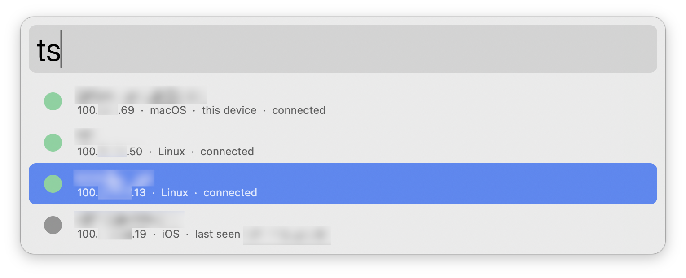
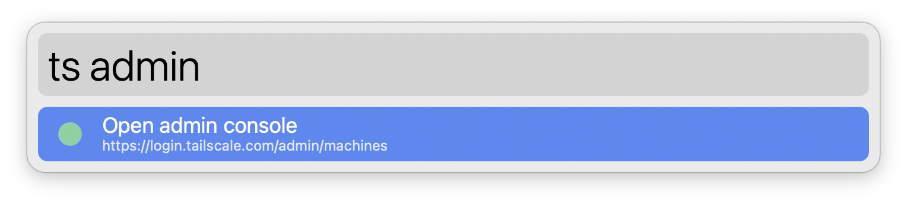
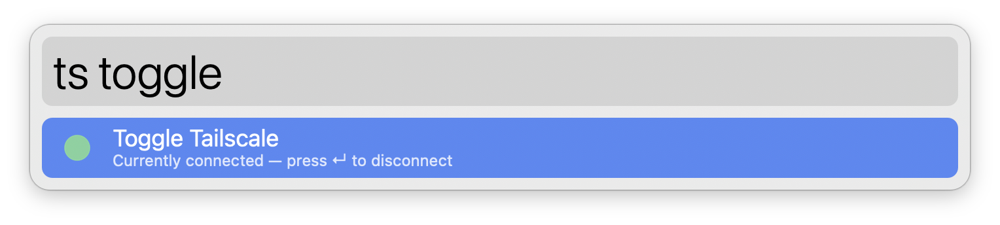
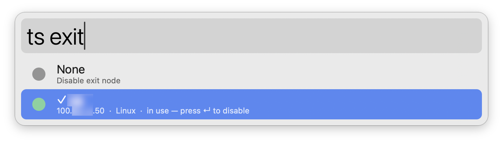

#  Tailscale Alfred Workflow

Browse your Tailnet, copy addresses, SSH into devices, and toggle the connection — all from Alfred.

## Usage

Browse your Tailnet devices via the `ts` keyword. Connected devices appear first; offline ones show their last-seen time.

* <kbd>↩&#xFE0E;</kbd> Copy MagicDNS name.
* <kbd>⌘</kbd><kbd>↩&#xFE0E;</kbd> Copy IPv4 address.
* <kbd>⌥</kbd><kbd>↩&#xFE0E;</kbd> Copy IPv6 address.
* <kbd>⇧</kbd><kbd>↩&#xFE0E;</kbd> SSH into the device (when [Tailscale SSH](https://tailscale.com/kb/1193/tailscale-ssh) is advertised).

Start typing to filter by name or address. Two command rows also become available — press <kbd>⇥</kbd> to autocomplete them.

### Open admin console

Type `ts admin` to open the [Tailscale admin console](https://login.tailscale.com/admin/machines) in your default browser.

### Toggle Tailscale

Type `ts toggle` to connect or disconnect. The subtitle shows the current state.

### Activate exit node

Type `ts exit` to pick a peer to route traffic through. The first row disables the exit node; whichever option is currently in use is marked with `✓`.

## Requirements

[Tailscale for macOS](https://tailscale.com/download/mac) must be installed. The workflow auto-detects the CLI at `/Applications/Tailscale.app/Contents/MacOS/Tailscale`, `/usr/local/bin/tailscale`, or `/opt/homebrew/bin/tailscale`.

## License

[MIT](./LICENSE)
